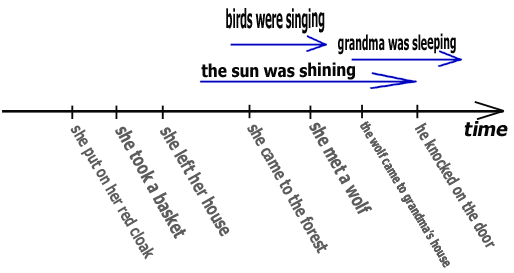
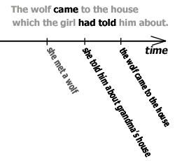
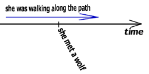
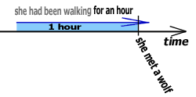

# Narrative tenses

## Past simple

Used for events with took place one after another.

## Past continuous

Used to describe the background of the action, saying "what was just happening when...".

## Past perfect simple

It is used for events that took place before the main event.

> She put on her cloak which her grandmother had given her for Christmas. 💡*Oblékla si plášť, který jí dala babička k
vánocům. Ten plášť přeci dostala daleko dříve, než vůbec náš příběh začíná.*  
> The wolf came to the house which the girl had told him about. 💡*Vlk dorazil k domečku, o kterém mu Karkulka řekla. O
domečku se dověděl už dříve.*  

## Past perfect continuous

We use it when we want to tell how long something had been going on when something happened, or which action led to
something happening.

> She had been walking through the forest for an hour when she met a wolf. 💡*Šla lesem asi hodinu, když potkala vlka. (
Předtím, než ho potkala, již hodinu šla.)*  

### Past continuous 🆚 past perfect continuous

> **past continuous** ➡ what was taking place  
> **past perfect continuous** ➡ what had been taking place until then  

 

## Future in the past

We use **would** or **was/were going to** (this describes the intentions rather than the future).

> She didn't know that the wolf would eat her. 💡*Nevěděla, že ji tento vlk sežere.*  
> She didn't know that the wolf was going to eat her. 💡*Nevěděla, že ji ten vlk má v úmyslu sežrat.*  

## Tenses not used in narrative

If we do not count the direct speech, we cannot use present and future tenses (including present perfect tenses).

> 🔴 I understood he **~~has~~** never been to Italy. ➡ 🟢 I understood he **had** never been to Italy.  

## 🍀 Narrative in present tense

Time-sequence rules are the same way for narrative in past tenses.

> She **comes** to the forest and meets a wolf. The wolf **says** ...  
> She **is walking** along the path, singing a song when she meets a wolf.  
