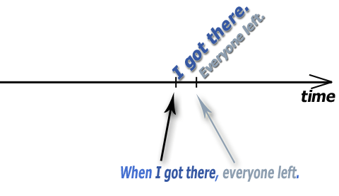
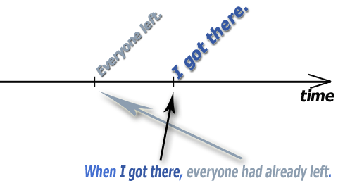

# Past tense

## Past simple

It is used for events that took place in the past. They could happen once or repeatedly.

> I wanted to buy a new bike.  
> We stayed in a beautiful hotel.  
> Did you see the lovely flowers?  
> Did your parents agree?  
> I didn't know what to do.  
> We didn't sleep well because of the storm.  

## Past continuous

### Usage

#### Something was happening in the past at some point in time

> At five o'clock we were watching TV.  
> When she arrived, we were watching TV.  
> He was having lunch when I called him.  
> I didn't hear you, I was listening to my walkman.  
> He was so funny. He was wearing a pink shirt and orange shorts.  
> This time last year, I was sunbathing on a beach.  

The conjunction **when** can be used before both simple and continuous verbs, but the conjunction **while** can be used
only before a continuous verb.

> When I was watching TV, he arrived. 🔃 I was watching TV when he arrived.  
> 🆚  
> He arrived while I was watching TV. 🔃 While I was watching TV, he arrived.  

#### Two independent and simultaneous events

> We **were watching** TV and she **was washing** up the dishes.  

If events are dependent, we must use past simple tense in one of the sentences.

> I **sang** while I **was driving** to work. 💡*Zpíval cestou, pouze v rámci té jízdy autem, nebyly to činnosti, které
by probíhaly nezávisle na sobě.*  

#### Incomplete events

💡 nedokonavé děje (co jsem dělal, ne co jsem udělal)

> Yesterday I wrote my book and then I repaired my bicycle. *Oba dějě dokončil.*  
> 🆚  
> Yesterday **I was writing** my book and then **I was repairing** my bicycle. 💡*Pravděpodobně nedokončil oba
dějě.*  

#### Where not used

**state verbs**

> 🔴 At that moment, I was wanting to disappear. ➡ 🟢 I wanted to disappear.  

**permanent events**

> 🔴 What was my job at that time? I was working as a teacher. ➡ 🟢 I worked as a teacher.  

**repeated events**

> 🔴 When I was a child, we were going to our weekend house every week. ➡ 🟢 We went to our weekend house every
> week.  

## Past perfect

It is very often used in narrative. It describes an action that had happened before something else in the past.

> When I arrived, everyone left. 💡*Když jsem dorazil, všichni odešli.*  
> 🆚  
> When I arrived, everyone had left. 💡*Když jsem dorazil, všichni už byli pryč.*  

 

It can be used in different types of sentences.

> **When** I switched the TV on, the match **had** already **started**.  
> **When** the police arrived, the robber **had** already **disappeared**.  
> I couldn't buy it **because** I **had** **forgotten** my wallet.  
> The teacher was disappointed **because** we **had** all **failed** the test.  
> Sarah had to mop the floor **because** her son **had** **spilled** milk all over the place.  
> I knew **that** something **had happened**.  
> She noticed **that** someone **had broken** her window.  
> I told my parents **that** I **had passed** the exam.  
> The book (**that/which**) I **had gotten** for Christmas turned out to be really fascinating.  
> Our car, **which** we **had bought** just a few months earlier, was stolen.  

It is often used to show that two events are independent.

> After he **had done** his homework, he watched some TV.  
> 🆚  
> He **fell** asleep as soon as he **closed** his eyes. 💡*Mohlo by znamenat, že oba děje mají nějakou spojitost, jeden
je závislý na druhém.*  

> When I **had switched** off my computer, I went downstairs to talk to my parents.  
> The doorbell rang as soon as she **had hung up** the phone.  

We do not use it when we say that something happened in the past. ❗Be careful of the conjunction **before**.

> She ran two miles on her elliptical **before** breakfast.  
> 🔴 He **~~had turned~~** the lights off before he left. ➡ 🟢 He **turned** the lights off before he left.
> 🔴 Before she could say anything, he **~~had got~~** down on one knee and asked her to marry him. ➡ 🟢 Before she could
> say anything, he **got** down on one knee and asked her to marry him.  

We can use **past perfect** with the conjunction **before** if we want to express that something happened before
something else had been finished (or it didn't happen at all).

> She was dead before the doctor had arrived. 💡*Příjezd doktora už tedy byl zbytečný.*  
> The case was dismissed before the police had finished their investigation. 💡*Policie vyšetřování ani
nedokončila.*  
> He was hit from behind before he had managed to turn around.  
> My parents returned before I had cleaned the apartment.  

> He was hit from behind before he had managed to turn around. 💡*K otočení už ani nedošlo.*  
> He was hit from behind before he managed to turn around. 💡*Praštili ho a až potom se mu podařilo se otočit.*  
