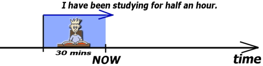
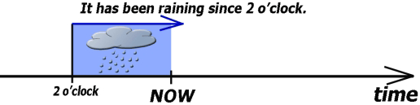
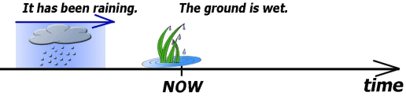

# Present tense

## Present simple

It is most often used where there is a persistent action or regular activity.

### Usage

#### Repeated activity

We often use adverbs or determinations like **often**, **sometimes**, **never**, **every day**, etc.

> I **see** my parents twice a week.  
> My sister **reads** every day.  
> I sometimes **work** from home.  
> My wife often **reads** in the evening.  

#### Long-term activity

> My older sister **lives** in London.  
> His wife **works** in a bank in the city centre.  

#### Customs and hobbies

> My dad **loves** gardening.  
> Paul **likes** rock music.  

#### General truth

> The sun **rises** in the east.  
> It usually **snows** in winter.  

#### Others

###### Narrative in present tense

See also [this article](/topics/parts-of-speech/verbs/tenses/past/narrative-tenses.md).

We just move the actions from the past to the present. It is mostly used in jokes or summaries of the plot of the book
or film (for example in a review). The story is then more dramatic, more engaging.

> A man **asks** his wife ...  
> I **come** home and **see** ...  
> A boy **meets** a girl who ...  
> The season finale **leaves** the viewers ...  

###### Sport comments

> Ramos **recovers** the ball and **passes** to Ronaldo, Ronaldo **shoots** ... Goal!  
> The whistle **goes** and **it's** all over!  
> Hamilton **pits** and Verstappen **takes** the lead.  

###### Newspaper headlines

Something happened in the past but we use the present tense.

> U.S. **Breaks** Single-Day Record for New Cases  
> Trump **Claims** Election is Rigged  
> Pit Bull **Attacks** Girl, Owner Arrested  

###### Caption of illustrations or photographs

We can face both the present nad the past tense.

> Robinson Crusoe **discovers** a footprint.  
> Passing through the wood, she **encounters** the Wolf.  
> Passing through the wood, she **encountered** the Wolf.  

##### Instructions and manuals

We can use either imperative or the present simple.

> After turning off the power, **take** a screwdriver and **remove** the top cover.  
> **Get off** at the second stop and take the subway.  

> After turning off the power, **you take** a screwdriver and **remove** the top cover.  
> **You get off** at the second stop and then it's a five-minute walk to the hotel.  

##### Future

It is used for fixed future, see also [this article](/topics/parts-of-speech/verbs/tenses/future/future-tense.md).

> The season **ends** on September 30.  
> The bus **leaves** at 7. Don't be late.  
> The new supermarket **opens** tomorrow.  

It is also used in conditional and time clauses. see also [time clauses](/topics/subordinate-clauses/time-clauses.md)
and [conditional clauses](/topics/subordinate-clauses/conditional-clauses.md).

> Call me when you **get there**, okay?  
> I'll be there for you if you **need** someone to talk to.  

##### Performative verbs

> 🔴 I'm apologizing. ➡ 🟢 I **apologize**.  
> I **object**, Your Honor!  
> I absolutely **forbid** it!  

See also [performative verbs](/topics/parts-of-speech/verbs/tenses/performative-verbs.md).

## Present continuous

### Usage

#### Current running events

It indicates the events that are taking place at the moment of speaking.

> Shhh. Mommy is sleeping.  
> Are you at work? – No, I'm going home.  
> We're playing Minecraft. Do you want to play with us?  

It may also be something that is not quite literally happening right now, but only at the moment (💡*dočasná činnost,
může probíhat přerušovaně*).

> I'm reading The Great Gatsby. 💡*Nemusím teď nutně sedět nad otevřenou knihou, říkám tím, že ji mám rozečtenou.*  
> He's watching Friends with his wife. 💡*Tato věta sice může znamenat, že teď právě sedí před obrazovkou a sledují
seriál Přátelé, ale také to, že mají ten seriál rozkoukaný, tedy jsou někde uprostřed.*  
> I'm reading a great book.  
> He's going to work by bus this week.  
> This is her seat. She's sitting here.  
> What are you drinking?  

#### Non-permanent repeated events

It can also express repeated events which are not permanent.

> I **visit** my parents a lot. 🆚 Now that I'm back, I'm visiting my parents a lot.  
> He's going jogging twice a day now. 💡*Jen teď dočasně, normálně chodí např. jen jednou týdně.*  
> She's working night shifts this week.  

Another example of repeated events.

> Every time I stop by, he **makes** me coffee. 💡*Kávu mi udělá, když přijdu*  
> 🆚  
> Every time I stop by, he ****is making**** me coffee. 💡*Kdykoliv přijdu, tak mi zrovna v tu chvíli vaří kávu*  

> Every time I stop by, he's working.  
> Whenever she looks at him, he is staring at her.  
> Every time I come to London, it's raining.  

#### Ongoing, long-lasting change

Very often we use a double comparative in these sentences (**more and more**, **higher and higher**, **less and less**,
etc.).

> Although they are on the list of endangered species, their numbers **are** steadily **rising**.  
> He is getting more and more fluent in English.  
> People are producing more and more garbage.  
> The water level was rising higher and higher.  
> It's a discipline that is constantly evolving.  

#### What bothers us, what is surprising or unexpected

We can use adverbs like **always**, **constantly**, **continually**, **forever**, etc.

> **He's always forgetting** my name. 💡*Neustále zapomíná, jak se jmenuji.*  
> My parents **are always telling** me what to do!  
> **I'm always forgetting** my car keys!  
> He **is constantly making**** inappropriate jokes about women.  
> **I'm continually tripping** over his stuff that's just lying around on the floor.  
> The zipper **is forever getting** stuck! 💡*Ten zip se pořád zasekává.*  
> **She's always giving** me chocolates. 💡*Vždycky mi dává čokoládu bonbony.*  

#### Future

See also [this article](/topics/parts-of-speech/verbs/tenses/future/future-tense.md#present-continuous).

> I'm flying to Egypt next week. 💡*Již máme všechno zařízeno.*  
> We'll miss the party. We're going to the theatre. 💡*Již máme lístky do divadla.*  
> I'm taking my driving test next week. Do you have any advice?  

#### Momentary behaviour

We use **be** in the present continuous tense.

> Are you serious? 💡*Myslíte to vážně?* 🆚 Are you being serious? 💡*Děláš si legraci, to myslí vážně?*  
> Don't mind him. He's an ass. 💡*Nevšímej si ho. Je to blbec.* 🆚 Don't mind him. He's being an ass. 💡*Chová se jak
blbec (právě teď).*  

We often use it with an adjective.

> He's just **being silly**.  
> I'm just **being honest** with you.  
> You're **being too hard** on yourself.  
> She said she liked my shirt. She was just **being nice**.  
> He wasn't flirting, he was **being friendly**.  
> Stop that, you're **being ridiculous**.  
> Are you **being sarcastic**?  
> She was **being weird**, don't you think?  

We can also use it with a noun. We express that somebody behaves like we would expect.

> Don't be mad at them. They're just **being kids**. 💡*Děti se chovají jako děti.*  
> He's just **being John**. 💡*John se chová jako John.*  
> I'm not pretending anything. I'm **being myself**. 💡*Já se chovám jako já.*  
> 🔴 ~~I'm being my mother.~~ ➡ 🟢 I'm **acting like** my mother.  

### Simple 🆚 continuous

> Harry **plays** football. 🆚 Harry **is playing** football.  
> We usually **have** dinner at six or seven. 🆚 **We're having** dinner.  
> My neighbor **sings** in the shower every night. 🆚 Listen! My neighbor **is singing**!  
> She **doesn't work** on weekends. 🆚 She **isn't working**. She's having lunch.  
> What **do you do**? 🆚 What **are you doing**?  
> Where **does he go** to school? 🆚 It's 10 o'clock. Where **is he going**?  

### Passive

> The car is serviced every year. 💡*Obecně, pravidelně se něco děje.*  
> 🆚  
> The car is being serviced right now. 💡*Právě se něco děje.*  

> They are renovating the hotel. ➡ The hotel **is being renovated** at the moment.
> We are working on it. ➡ **It's being worked** on, don't worry.
> They are unloading it. ➡ The truck **is being unloaded** right now.
> We are processing it. ➡ Your order **is being processed**.
> A child was driving it. ➡ The car **was being driven** by a little child!
> We are making the changes. ➡ The changes **are being made** as we speak.

## Short answers

We cannot use a meaning verb alone.

> 🔴 Do you live here? Yes, I live. ➡ 🟢 Yes, **I do**.  
> 🔴 Does he love you? ➡ 🟢 No, **he doesn't**.  
> Are you working? Yes, **I am**.  

## Present perfect

💡 předpřítomný čas, přítomný čas dokonavý

It is connected with the present, it describes current situation.

Shortcuts, short answers work as usual.

> **We've** met.  
> **I've** finished.  
> I **haven't** finished.  
> He **hasn't** gone out.  
> Have you seen Jurassic Park? Yes, **I have**.  
> Has he returned yet? Yes, **he hasn't**.  

### Usage

#### Something has changed

Something has changed and now it is different, now it is changed. So it brings together that something has happened and
that something is now. The emphasis here is on how it is now, not on when it happened, how it happened, why it happened,
etc. We are simply expressing the change.

> **I've bought** a new car. 💡*I have the car now. I do not care when, where, how much did it cost, etc.*  
> 🆚  
> I **bought** a new car last month. 💡*when*  
> I **bought** it at the new shop in the city center. 💡*where*  
> I **bought** it for £11,000. 💡*how much*  

> **He's quit** his job. 💡*Nyní už tam nepracuje.*  
> 🆚  
> He **quit** his job yesterday.  
> He **quit** because of his boss.  
> He **quit** before his boss could fire him.  

> I've recently visited the USA.  

#### Experience gained so far

💡 něco se již stalo nebo naopak ještě nestalo

> **Did you watch** Forrest Gump last night? Yes, I **did**.  
> 🆚  
> **Have you seen** Forrest Gump? Yes, I **have**.  

We often use adverbs **ever**, **never**, **before** (at the end of the sentence), **yet** or **already**.

> Have you **ever** been to Spain?  
> Has your dad **ever** forgotten your birthday?  
> I've **never** ridden a horse.  
> Her boyfriend has **never** cooked for her.  
> I think I've seen this film **before**.  
> I think I know you. Have we met **before**? 💡*Není to poprvé, co ho vidím.*  
> I've **never** had sushi **before**. 💡*Toto je poprvé, ještě nikdy předtím jsem ho neměl.*  

**Yet** is used at the end of the **question** or **negative sentence**. We use it for events which are expected to
happen.

> Have you done your homework yet? 💡*Od dotyčného se očekává, že domácí úkoly udělá. Ptáme se, jestli už se tak
stalo.*  
> Have they fixed the elevator yet? 💡*Čekáme, že by ho teď někdy měli opravit.*  
> I haven't done the dishes yet. 💡*Od dotyčného se to očekává, ale ještě se to nestalo.*  

#### Current "score"

> It **was** a good match. We scored three goals. 🆚 **We've scored** two goals **so far**.  
> I had five cups of coffee yesterday. 🆚 **I've had** three cups of coffee today.  
> In his life, he visited London many times. 💡*Již nežije.* 🆚 **He's been** to London five times.  
> Oscar Wilde only wrote one novel. 💡*Již nežije.* 🆚 Andy Weir has written several novels. 💡*Stále žije.*  
> **I've read** ten books this year.  
> **I've seen** this movie about twenty times.  
> I have driven a car 3 times in my life.  

#### Summary

The present perfect tense have the connection with present. Do not use it if the actions finished in the past.

> We have to go to lunch, I didn't have breakfast today.  
> I am going to bed, I got up at 5 today.  
> Where did you go on holiday this year? 💡*It is winter right now.* 

### Already, yet, etc.

#### Already

💡 dřív, než se čekalo

We use it in the positive sentences when something has happened sooner than we expected.

> Can you please feed the dog? But I've **already** fed her.  
> What do you want for dinner, pizza or tacos? Nothing, I've **already** eaten.  

Sometimes we can use it event in question, but then it's more of a wonder than a question. We also use the announcing
word order.

> What? They're **already** here? 💡*Člověk se zhrozil, že jeho návštěva už dorazila a on je přitom očekával až
později.*  
> The new R.E.M. album is excellent! What, you've **already** heard it?  

#### Yet

💡 už, ještě ne (něco, co se očekává)

We use it at the end of the questions or negative sentences.

We use it when we are talking about something that is expected of someone, and the sentence then asks whether the person
has already done the expected thing, or the interviewee reports that they have not yet done it.

> Mark, have you taken out the rubbish **yet**? 💡*Rodiče zřejmě očekávají, že Mark bude vynášet odpadky, proto se ptají,
jestli už je vynesl, nebo ne.*  
> Have we paid the phone bill **yet**? 💡*Telefonní účty se mají platit, očekává se, že se budou platit, proto se dotyčný
ptá, jestli už mají ten účet zaplacený.*  
> My parents haven't returned **yet**.  
> I haven't seen the new Harry Potter movie **yet**. 💡*Viděl jsem všechny ostatní díly a očekávám, že shlédnu i ten nový
film, ještě k tomu ale nedošlo.*  
> Have you taken out the rubbish? No, not **yet**.  

**Yet** has also other meanings. One of them is 💡*a přesto, a přitom* to express contrast between two things.

> I told him to go away and **yet** he's still here.  
> Interesting, the room is clean, and yet he was not here.  

#### Still

💡 stále ještě

It is very often used in the negative sentences to express that something has not happened yet. **Still** is used before
a negative auxiliary verb.

> I **still** haven't found what I'm looking for. 💡*Člověk něco nějakou dobu hledá, ale i přesto to ještě
nenašel.*  
> I **still** haven't found the answer.  

We can use it in questions or positive sentences with the present tense.

> The children are **still** at school. 💡*Člověk by čekal, že touto dobou už budou doma, ale nejsou, jsou stále ještě ve
škole.*  
> Are you **still** here?  

Compare it with **always** or **keep telling**.

> He's **always** mad at me. 💡*Stále (pořád, neustále, vždy) se na mě zlobí.*  
> 🆚  
> He's **still** mad at me. 💡*Stále ještě se na mě zlobí (ještě nepřestal).*  

> He **keeps telling** me what to do. 💡*Pořád mi říká, co mám dělat.*  
> 🆚  
> He **still** tells me what to do. 💡*Stále ještě mi říká, co mám dělat (dělal to kdysi, a dělá to i nyní, ještě s tím
nepřestal).*  

#### Ever, never

💡 už někdy, ještě nikdy

**Ever** is often used in questions, but can be used even in positive sentences which express how many times we have
done something.

> Have you **ever** seen U2 live?  
> Have you **ever** been to the USA?  
> This is the first time I've **ever** been snowboarding.  

**Never** is used in negative sentences.

> I've **never** heard about him.  
> We've **never** met.  

These adverbs can be used in other tenses as well.

### Examples

#### Have been

💡 odjet, být (a už být zpět)

❗The preposition **to** must be used, the verb describes a movement.

> She **has gone to** Paris. 💡*Odjela do Paříže.* 🆚 She **has been to** Paris twice. 💡*Byla v Paříži dvakrát.*  
> 🔴 She has been **~~in~~** Paris twice. ➡ 🟢 She has been **to** Paris twice.  
> Paul's been to the supermarket.  
> Megan has never been to China.  

#### Have gone

💡 odjet (a stále tam být)

It is connected with a place.

> He's gone home. 💡*Odešel domů.*  
> Jack's gone to work. 💡*Jack odešel do práce.*  
> Where has everybody gone? 💡*Kam všichni odešli?*  
> They've gone to the supermarket. 💡*Šli nakoupit.*  
> I've gone to London. 💡*Odjel jsem do Londýna (a ještě tam jsem).*  
> She has gone to bed.  

#### Be gone

💡 být pryč

**Gone** is here a simple adjective.

> He is gone. 💡*Je pryč.*  
> He has gone home. 💡*Odešel domů.*  
> I don't know where Steve is. He's gone.  
> The cookies are gone. Have you eaten them?  
> When we arrived, everybody was gone.  

### Present perfect continuous

> **present perfect simple** - puts not on the finished result of the action  
> **present perfect continuous** - puts emphasis on the duration or course of action  

#### Usage

##### How long has something been going on

We use the prepositions **since** (💡*od kdy*) and **for** (💡*jak již dlouho*).

> I have been learning English for three years. 💡*Učím se již tři roky, tedy učení již tři roky probíhá.*  
> How long have you been waiting for me? 💡*Ptám se, jak dlouho už tu čeká, tedy jak dlouho ten děj již probíhá.*  

> 🔴 ~~I am waiting here for two hours.~~  
> ➡ I **am waiting** here. 💡*Čekám tu. (Pouze říkám, co probíhá právě teď.)*  
> ➡ I **have been waiting** here for an hour. 💡*Čekám tu už hodinu. (Kromě toho, že tu právě teď čekám, říkáme i to, jak
> dlouho již to trvá, tedy ne jen to, co je teď, ale i to, co už bylo.)*  

We can use present perfect simple if the fact had been going on very long, therefore we consider it as a permanent fact.

> I **have been living** here for two years. 💡*Bydlím tu teprve krátkou dobu, sám průběhovým časem vyjadřuji, že se
jedná o kratší dobu.*  
> 🆚  
> I **have lived** here all my life. 💡*Říkám, že tu bydlím od narození, tedy vždy jsem tu bydlel. Nedáváme důraz na dobu
trvání, ale říkáme spíše to, že to tak bylo vždycky (ne že to teprve nějakou dobu probíhá, prostě to tak je)*  

Sometimes it depends on the point of view of the speaker.
> I **have been living** here for ten years.  
> 🆚  
> I **have lived** here for ten years.  

We can omit the preposition **for** in the positive sentences.

> The journey lasts **for** two hours. 🔃 The journey lasts two hours.  

##### What caused the current state

We use it for actions that took place (they are not taking place right now) but we can see their outcomes.

> I'm tired because **I've been working** out. 💡*Posiloval jsem a to vedlo k tomu, že jsem teď unavený (i když už
neposiluji).*  
> Why are you so dirty? **I've been repairing** my car. 💡*Opět říkáme, že jsem špinavý, protože jsem opravoval auto,
tedy to opravování auta vedlo k tomu, že jsem teď špinavý.*  
> It's wet because it's been raining. 💡*Je mokro a vedlo k tomu to, že pršelo (i když už asi neprší). Říkáme však, že
děj (déšť) vedl k současnému výsledku (mokru).*  

##### Emphasis on action, not on result

> **He's cooked** dinner. 💡*Uvařil jídlo.* 🆚 He's been cooking dinner. 💡*Uvařil nebo neuvařil jídlo? Kdo ví...*  
> **He's fixed** his motorbike. 🆚 **He's been fixing** his motorbike.  
> **She's painted** the walls. 🆚 **She's been painting** the walls.  
> **I've repaired** my car. 🆚 I **have been repairing** my car.  
