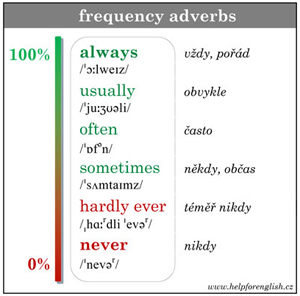

# Present tense

## Present simple

It is most often used where there is a persistent action or regular activity.

### Usage

#### Repeated activity

We often use adverbs or determinations like **often**, **sometimes**, **never**, **every day**, etc.

> I **see** my parents twice a week.  
> My sister **reads** every day.  
> I sometimes **work** from home.  
> My wife often **reads** in the evening.  

#### Long-term activity

> My older sister **lives** in London.  
> His wife **works** in a bank in the city centre.  

#### Customs and hobbies

> My dad **loves** gardening.  
> Paul **likes** rock music.  

#### General truth

> The sun **rises** in the east.  
> It usually **snows** in winter.  

## Present continuous

It indicates the events that are taking place at the moment of speaking.

> Shhh. Mommy is sleeping.  
> Are you at work? – No, I'm going home.  
> We're playing Minecraft. Do you want to play with us?  

It may also be something that is not quite literally happening right now, but only at the moment (💡*dočasná činnost,
může probíhat přerušovaně*).

> I'm reading The Great Gatsby. 💡*Nemusím teď nutně sedět nad otevřenou knihou, říkám tím, že ji mám rozečtenou.*  
> He's watching Friends with his wife. 💡*Tato věta sice může znamenat, že teď právě sedí před obrazovkou a sledují
seriál Přátelé, ale také to, že mají ten seriál rozkoukaný, tedy jsou někde uprostřed.*  
> I'm reading a great book.  
> He's going to work by bus this week.  
> This is her seat. She's sitting here.  
> What are you drinking?  

### Simple 🆚 continuous

> Harry **plays** football. 🆚 Harry **is playing** football.  
> We usually **have** dinner at six or seven. 🆚 **We're having** dinner.  
> My neighbor **sings** in the shower every night. 🆚 Listen! My neighbor **is singing**!  
> She **doesn't work** on weekends. 🆚 She **isn't working**. She's having lunch.  
> What **do you do**? 🆚 What **are you doing**?  
> Where **does he go** to school? 🆚 It's 10 o'clock. Where **is he going**?  

## Short answers

We cannot use a meaning verb alone.

> 🔴 Do you live here? Yes, I live. ➡ 🟢 Yes, **I do**.  
> 🔴 Does he love you? ➡ 🟢 No, **he doesn't**.  
> Are you working? Yes, **I am**.  

## Present perfect

💡 předpřítomný čas, přítomný čas dokonavý

It is connected with the present, it describes current situation.

Shortcuts, short answers work as usual.

> **We've** met.  
> **I've** finished.  
> I **haven't** finished.  
> He **hasn't** gone out.  
> Have you seen Jurassic Park? Yes, **I have**.  
> Has he returned yet? Yes, **he hasn't**.  

### Usage

#### Something has changed

Something has changed and now it is different, now it is changed. So it brings together that something has happened and
that something is now. The emphasis here is on how it is now, not on when it happened, how it happened, why it happened,
etc. We are simply expressing the change.

> **I've bought** a new car. 💡*I have the car now. I do not care when, where, how much did it cost, etc.*  
> 🆚  
> I **bought** a new car last month. 💡*when*  
> I **bought** it at the new shop in the city center. 💡*where*  
> I **bought** it for £11,000. 💡*how much*  

> **He's quit** his job. 💡*Nyní už tam nepracuje.*  
> 🆚  
> He **quit** his job yesterday.  
> He **quit** because of his boss.  
> He **quit** before his boss could fire him.  

#### Experience gained so far

💡 něco se již stalo nebo naopak ještě nestalo

> **Did you watch** Forrest Gump last night? Yes, I **did**.  
> 🆚  
> **Have you seen** Forrest Gump? Yes, I **have**.  

We often use adverbs **ever**, **never**, **before** (at the end of the sentence), **yet** or **already**.

> Have you **ever** been to Spain?  
> Has your dad **ever** forgotten your birthday?  
> I've **never** ridden a horse.  
> Her boyfriend has **never** cooked for her.  
> I think I've seen this film **before**.  
> I think I know you. Have we met **before**? 💡*Není to poprvé, co ho vidím.*  
> I've **never** had sushi **before**. 💡*Toto je poprvé, ještě nikdy předtím jsem ho neměl.*  

**Yet** is used at the end of the **question** or **negative sentence**. We use it for events which are expected to
happen.

> Have you done your homework yet? 💡*Od dotyčného se očekává, že domácí úkoly udělá. Ptáme se, jestli už se tak
stalo.*  
> Have they fixed the elevator yet? 💡*Čekáme, že by ho teď někdy měli opravit.*  
> I haven't done the dishes yet. 💡*Od dotyčného se to očekává, ale ještě se to nestalo.*  

#### Current "score"

> It **was** a good match. We scored three goals. 🆚 **We've scored** two goals **so far**.  
> I had five cups of coffee yesterday. 🆚 **I've had** three cups of coffee today.  
> In his life, he visited London many times. 💡*Již nežije.* 🆚 **He's been** to London five times.  
> Oscar Wilde only wrote one novel. 💡*Již nežije.* 🆚 Andy Weir has written several novels. 💡*Stále žije.*  
> **I've read** ten books this year.  
> **I've seen** this movie about twenty times.  
> I have driven a car 3 times in my life.  

#### Summary

The present perfect tense have the connection with present. Do not use it if the actions finished in the past.

> We have to go to lunch, I didn't have breakfast today.  
> I am going to bed, I got up at 5 today.  
> Where did you go on holiday this year? 💡*It is winter right now.* 